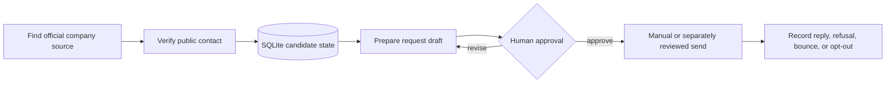

<div align="center">

# Ichigo Donne Stage

**A privacy-clean workflow for preparing observation-placement requests without automating contact.**

[](https://www.python.org/)
[](https://www.sqlite.org/)
[](LICENSE)
[](#verification)

</div>

---

## The idea

A stage or observation request should be researched carefully, written clearly, and approved before it leaves the machine. `ichigo-donne-stage` provides the local workflow for doing exactly that.

It keeps the candidate record, public source, draft, approval code, and response history connected without including a real identity, school, company contact list, or sending integration.

## Workflow



## What it provides

- local SQLite state for organizations, touchpoints, replies, refusals, bounces, and opt-outs;
- official-source and public-contact validation;
- deterministic approval IDs and explicit confirmation handling;
- draft generation with an exact content snapshot;
- idempotent state transitions and ambiguous-send protection;
- policy examples that can be adapted to local legal and safeguarding requirements.

## What it does not provide

- automatic email sending;
- Gmail, Discord, CRM, or school-system connectors;
- real candidate information or contact data;
- legal advice or a universal safeguarding policy;
- a promise that an organization accepts observation requests.

The final contact decision remains human-owned.

## Quick start

```bash
git clone https://github.com/OnkLiam/ichigo-donne-stage.git
cd ichigo-donne-stage

python3 -m venv .venv
. .venv/bin/activate
pip install -r requirements.txt
python -m pytest -q
```

Inspect the available local commands:

```bash
python src/stage_db.py --help
python src/stage_workflow.py --help
```

The tests use synthetic organizations and reserved `.invalid` domains. No network request is made.

## Repository map

```text
src/
├── stage_db.py                # SQLite schema and state transitions
└── stage_workflow.py          # source checks, drafts, approval, and idempotence

templates/
└── policy.example.yaml        # policy starting point, not legal advice

tests/
├── test_stage_db.py
└── test_stage_workflow.py
```

## Safety rules

Before preparing a request, the workflow expects:

- an official website or source URL;
- a public contact address discovered from that source;
- a clear reason for the request;
- a realistic fit score;
- a draft that states what is being requested without overpromising;
- explicit human approval of the exact recipient and message.

If a person asks not to be contacted, the refusal or opt-out must become a durable suppression state.

## Verification

```text
6 tests passed
```

The suite covers lead state, touchpoint state, deterministic approvals, explicit confirmation, draft preparation, refusal handling, and opt-out behavior.

## License

MIT. This repository contains generic workflow code and synthetic examples. Adapt the policy and templates to the laws, school rules, and safeguarding requirements that apply to your situation.
